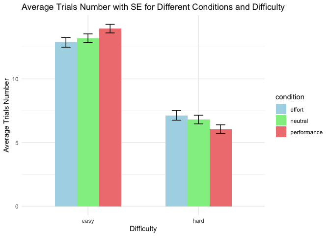

# PSYC521_WangShuning
Shuning Wang
2025-05-02

    Warning: Removed 197 rows containing non-finite outside the scale range
    (`stat_bin()`).

    Warning: Removed 197 rows containing non-finite outside the scale range
    (`stat_bin()`).

    # A tibble: 2 × 5
      difficulty mean_rt sd_rt mean_accuracy sd_accuracy
      <chr>        <dbl> <dbl>         <dbl>       <dbl>
    1 easy          993.  221.         0.966      0.0827
    2 hard         1121.  330.         0.896      0.192 

    # A tibble: 2 × 3
      difficulty mean_trialsNum se_trialsNum
      <chr>               <dbl>        <dbl>
    1 easy                13.3         0.204
    2 hard                 6.66        0.204

    `summarise()` has grouped output by 'difficulty'. You can override using the
    `.groups` argument.

    # A tibble: 6 × 4
      difficulty condition   mean_trialsNum se_trialsNum
      <chr>      <chr>                <dbl>        <dbl>
    1 easy       effort               12.9         0.381
    2 easy       neutral              13.2         0.339
    3 easy       performance          13.9         0.338
    4 hard       effort                7.13        0.381
    5 hard       neutral               6.81        0.339
    6 hard       performance           6.05        0.338

    Warning in checkConv(attr(opt, "derivs"), opt$par, ctrl = control$checkConv, :
    unable to evaluate scaled gradient

    Warning in checkConv(attr(opt, "derivs"), opt$par, ctrl = control$checkConv, :
    Model failed to converge: degenerate Hessian with 1 negative eigenvalues

    Linear mixed model fit by REML ['lmerMod']
    Formula: 
    task_rt ~ 1 + (1 | subject) + (1 | difficulty) + (1 | subject:difficulty) +  
        (1 | condition:subject)
       Data: data_trialByTrial
     Subset: block == "post_training"

    REML criterion at convergence: 221375.2

    Scaled residuals: 
        Min      1Q  Median      3Q     Max 
    -2.9760 -0.6554 -0.1380  0.4881  5.6967 

    Random effects:
     Groups             Name        Variance  Std.Dev. 
     subject:difficulty (Intercept) 9.678e+03  98.37532
     condition:subject  (Intercept) 3.760e+04 193.90491
     subject            (Intercept) 1.229e-03   0.03506
     difficulty         (Intercept) 8.695e+03  93.24696
     Residual                       1.186e+05 344.36084
    Number of obs: 15115, groups:  
    subject:difficulty, 1325; condition:subject, 761; subject, 761; difficulty, 2

    Fixed effects:
                Estimate Std. Error t value
    (Intercept)  1058.01      66.45   15.92
    optimizer (nloptwrap) convergence code: 0 (OK)
    unable to evaluate scaled gradient
    Model failed to converge: degenerate  Hessian with 1 negative eigenvalues

| source             |       var | percent |
|:-------------------|----------:|--------:|
| subject:difficulty |   9677.70 |    0.06 |
| condition:subject  |  37599.11 |    0.22 |
| subject            |      0.00 |    0.00 |
| difficulty         |   8695.00 |    0.05 |
| Residual           | 118584.39 |    0.68 |

Failed to converge, so I dropped condition:subject

    Linear mixed model fit by REML ['lmerMod']
    Formula: 
    task_rt ~ 1 + (1 | subject) + (1 | difficulty) + (1 | subject:difficulty)
       Data: data_trialByTrial
     Subset: block == "post_training"

    REML criterion at convergence: 221375.2

    Scaled residuals: 
        Min      1Q  Median      3Q     Max 
    -2.9760 -0.6554 -0.1380  0.4881  5.6967 

    Random effects:
     Groups             Name        Variance Std.Dev.
     subject:difficulty (Intercept)   9678    98.38  
     subject            (Intercept)  37600   193.91  
     difficulty         (Intercept)   8745    93.52  
     Residual                       118584   344.36  
    Number of obs: 15115, groups:  
    subject:difficulty, 1325; subject, 761; difficulty, 2

    Fixed effects:
                Estimate Std. Error t value
    (Intercept)  1058.01      66.64   15.88

| source             |       var | percent |
|:-------------------|----------:|--------:|
| subject:difficulty |   9677.69 |    0.06 |
| subject            |  37599.87 |    0.22 |
| difficulty         |   8745.13 |    0.05 |
| Residual           | 118584.25 |    0.68 |

    Linear mixed model fit by REML ['lmerMod']
    Formula: 
    task_accuracy ~ 1 + (1 | subject) + (1 | difficulty) + (1 | subject:difficulty)
       Data: data_trialByTrial
     Subset: block == "post_training"

    REML criterion at convergence: -3130.4

    Scaled residuals: 
        Min      1Q  Median      3Q     Max 
    -4.5590  0.0382  0.1337  0.3168  3.3922 

    Random effects:
     Groups             Name        Variance Std.Dev.
     subject:difficulty (Intercept) 0.003078 0.05548 
     subject            (Intercept) 0.004407 0.06639 
     difficulty         (Intercept) 0.001718 0.04145 
     Residual                       0.043750 0.20917 
    Number of obs: 15220, groups:  
    subject:difficulty, 1325; subject, 761; difficulty, 2

    Fixed effects:
                Estimate Std. Error t value
    (Intercept)  0.93551    0.02951    31.7

| source             |  var | percent |
|:-------------------|-----:|--------:|
| subject:difficulty | 0.00 |    0.06 |
| subject            | 0.00 |    0.08 |
| difficulty         | 0.00 |    0.03 |
| Residual           | 0.04 |    0.83 |

