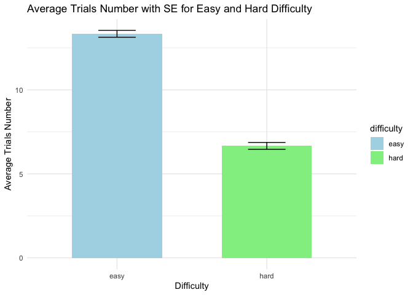
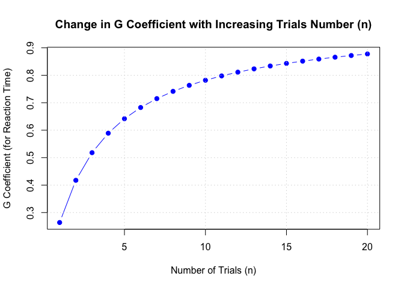
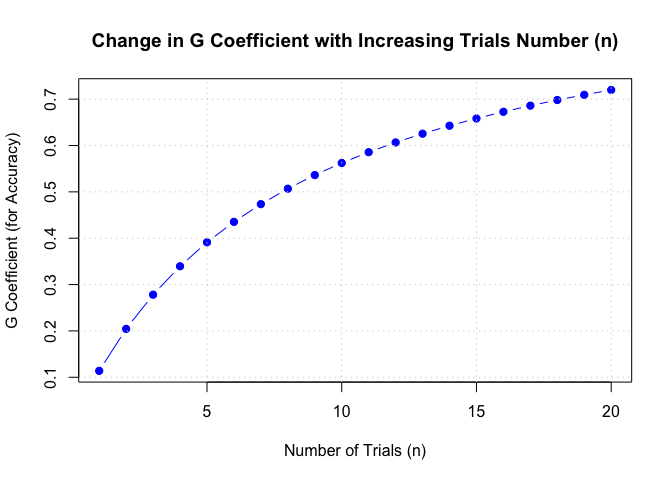

# PSYC520_WangShuning_v3_FinalReport
Shuning Wang
2025-05-13

    Warning: Removed 197 rows containing non-finite outside the scale range
    (`stat_bin()`).

    Warning: Removed 197 rows containing non-finite outside the scale range
    (`stat_bin()`).

    # A tibble: 2 × 5
      difficulty mean_rt sd_rt mean_accuracy sd_accuracy
      <chr>        <dbl> <dbl>         <dbl>       <dbl>
    1 easy          993.  221.         0.966      0.0827
    2 hard         1121.  330.         0.896      0.192 

    # A tibble: 2 × 3
      difficulty mean_trialsNum se_trialsNum
      <chr>               <dbl>        <dbl>
    1 easy                13.3         0.204
    2 hard                 6.66        0.204

    `summarise()` has grouped output by 'difficulty'. You can override using the
    `.groups` argument.

    # A tibble: 6 × 4
      difficulty condition   mean_trialsNum se_trialsNum
      <chr>      <chr>                <dbl>        <dbl>
    1 easy       effort               12.9         0.381
    2 easy       neutral              13.2         0.339
    3 easy       performance          13.9         0.338
    4 hard       effort                7.13        0.381
    5 hard       neutral               6.81        0.339
    6 hard       performance           6.05        0.338

    boundary (singular) fit: see help('isSingular')

    Linear mixed model fit by REML ['lmerMod']
    Formula: task_rt ~ 1 + (1 | subject:condition) + (1 | difficulty) + (1 |  
        condition) + (1 | condition:difficulty)
       Data: data_trialByTrial
     Subset: block == "post_training"

    REML criterion at convergence: 221453.2

    Scaled residuals: 
        Min      1Q  Median      3Q     Max 
    -3.0161 -0.6629 -0.1405  0.4887  5.6861 

    Random effects:
     Groups               Name        Variance Std.Dev.
     subject:condition    (Intercept)  43555   208.70  
     condition:difficulty (Intercept)      0     0.00  
     condition            (Intercept)      0     0.00  
     difficulty           (Intercept)   9115    95.47  
     Residual                         121542   348.63  
    Number of obs: 15115, groups:  
    subject:condition, 761; condition:difficulty, 6; condition, 3; difficulty, 2

    Fixed effects:
                Estimate Std. Error t value
    (Intercept)     1058         68   15.56
    optimizer (nloptwrap) convergence code: 0 (OK)
    boundary (singular) fit: see help('isSingular')

| source               |       var | percent |
|:---------------------|----------:|--------:|
| subject:condition    |  43555.21 |    0.25 |
| condition:difficulty |      0.00 |    0.00 |
| condition            |      0.00 |    0.00 |
| difficulty           |   9114.96 |    0.05 |
| Residual             | 121541.74 |    0.70 |

    Warning in checkConv(attr(opt, "derivs"), opt$par, ctrl = control$checkConv, :
    Model failed to converge with max|grad| = 0.0439503 (tol = 0.002, component 1)

    Linear mixed model fit by REML ['lmerMod']
    Formula: task_accuracy ~ 1 + (1 | subject:condition) + (1 | difficulty) +  
        (1 | condition) + (1 | condition:difficulty)
       Data: data_trialByTrial
     Subset: block == "post_training"

    REML criterion at convergence: -3051.2

    Scaled residuals: 
        Min      1Q  Median      3Q     Max 
    -4.6483  0.0413  0.1697  0.3484  3.3378 

    Random effects:
     Groups               Name        Variance  Std.Dev.
     subject:condition    (Intercept) 5.754e-03 0.075852
     condition:difficulty (Intercept) 2.173e-05 0.004662
     condition            (Intercept) 2.747e-05 0.005241
     difficulty           (Intercept) 1.774e-03 0.042117
     Residual                         4.492e-02 0.211934
    Number of obs: 15220, groups:  
    subject:condition, 761; condition:difficulty, 6; condition, 3; difficulty, 2

    Fixed effects:
                Estimate Std. Error t value
    (Intercept)  0.93611    0.03018   31.02
    optimizer (nloptwrap) convergence code: 0 (OK)
    Model failed to converge with max|grad| = 0.0439503 (tol = 0.002, component 1)

| source               |  var | percent |
|:---------------------|-----:|--------:|
| subject:condition    | 0.01 |    0.11 |
| condition:difficulty | 0.00 |    0.00 |
| condition            | 0.00 |    0.00 |
| difficulty           | 0.00 |    0.03 |
| Residual             | 0.04 |    0.86 |

    Linear mixed model fit by REML ['lmerMod']
    Formula: task_rt ~ 1 + (1 | subject) + (1 | difficulty)
       Data: data_trialByTrial
     Subset: block == "post_training"

    REML criterion at convergence: 221453.2

    Scaled residuals: 
        Min      1Q  Median      3Q     Max 
    -3.0161 -0.6629 -0.1405  0.4887  5.6861 

    Random effects:
     Groups     Name        Variance Std.Dev.
     subject    (Intercept)  43555   208.7   
     difficulty (Intercept)   9120    95.5   
     Residual               121542   348.6   
    Number of obs: 15115, groups:  subject, 761; difficulty, 2

    Fixed effects:
                Estimate Std. Error t value
    (Intercept)  1058.32      68.02   15.56

| source     |       var | percent |
|:-----------|----------:|--------:|
| subject    |  43554.62 |    0.25 |
| difficulty |   9119.75 |    0.05 |
| Residual   | 121541.81 |    0.70 |

    Linear mixed model fit by REML ['lmerMod']
    Formula: task_accuracy ~ 1 + (1 | subject) + (1 | difficulty)
       Data: data_trialByTrial
     Subset: block == "post_training"

    REML criterion at convergence: -3050.1

    Scaled residuals: 
        Min      1Q  Median      3Q     Max 
    -4.6604  0.0459  0.1722  0.3519  3.3277 

    Random effects:
     Groups     Name        Variance Std.Dev.
     subject    (Intercept) 0.005772 0.07597 
     difficulty (Intercept) 0.001700 0.04123 
     Residual               0.044923 0.21195 
    Number of obs: 15220, groups:  subject, 761; difficulty, 2

    Fixed effects:
                Estimate Std. Error t value
    (Intercept)  0.93616    0.02934   31.91

| source     |  var | percent |
|:-----------|-----:|--------:|
| subject    | 0.01 |    0.11 |
| difficulty | 0.00 |    0.03 |
| Residual   | 0.04 |    0.86 |

Decision Studies

